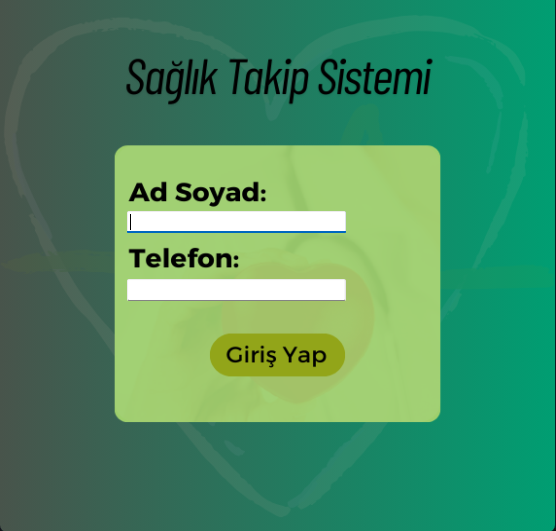
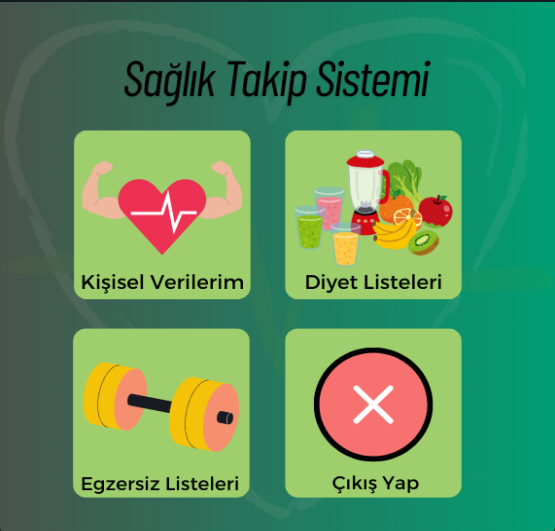
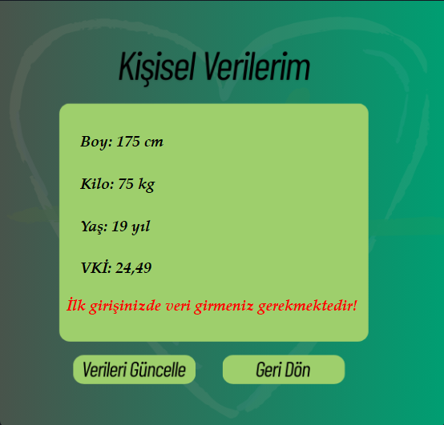
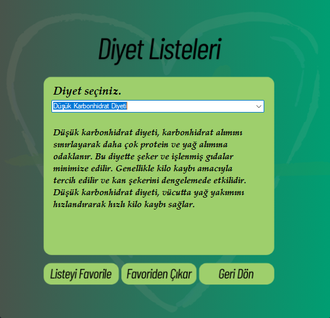
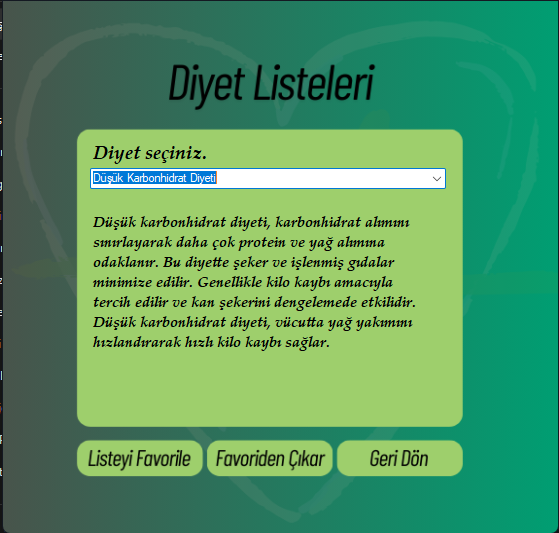
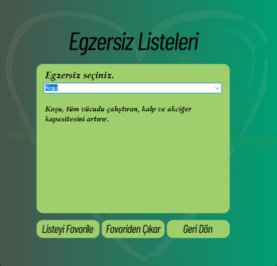

# 🏥 Kişisel Sağlık Takip Sistemi

Bu proje, **C# Windows Forms** kullanılarak geliştirilmiş bir **Kişisel Sağlık Takip Sistemi** uygulamasıdır. Kullanıcılar, sağlık verilerini takip edebilir, günlük aktivitelerini kaydedebilir, sağlık istatistiklerini görüntüleyebilir ve belirli sağlık hedefleri belirleyebilir. Proje eğitim amaçlıdır.

## 🧩 Özellikler

- Günlük sağlık verisi girişi
- Kullanıcı sağlık bilgilerini kaydetme
- İstatistiksel veriler ile sağlık durumu takibi
- Sağlık hedefleri belirleyebilme
- Basit ve kullanıcı dostu arayüz

## 🛠️ Kullanılan Teknolojiler

- C# (Windows Forms)
- .NET Framework
- Visual Studio
- (Opsiyonel: JSON, XML ya da SQL Server ile veri saklama)

## 🖼️ Uygulama İçi Ekran Görüntüleri

